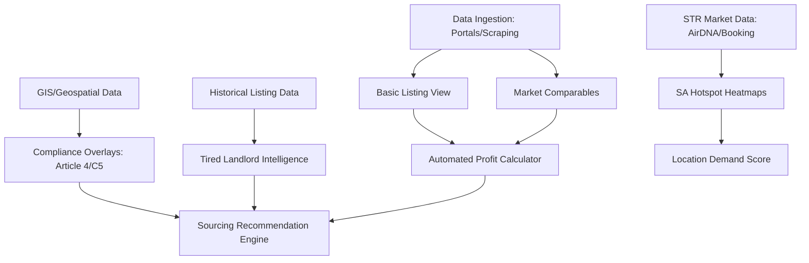

# Feature Landscape: Property Intel

**Domain:** UK Property Intelligence (Rent-to-Rent, SA, HMO)
**Researched:** 2026-02-28
**Overall Confidence:** HIGH

## Table Stakes

Features users expect in any modern property intelligence tool. Missing these will result in immediate churn.

| Feature | Why Expected | Complexity | Notes |
|---------|--------------|------------|-------|
| **Interactive Map Interface** | Core visualization of hotspots and listings. | Medium | Must handle thousands of markers efficiently. |
| **Portal Data Ingestion** | Users need to see what's actually on the market (Zoopla, OpenRent, SpareRoom). | High | Fragile due to anti-scraping measures; requires robust proxies/APIs. |
| **Automated Profit Calculator** | Instant ROI/Yield calculation based on user inputs + market averages. | Low | Essential for "Deal or No Deal" decisions. |
| **Basic Property Filters** | Filter by Price, Beds, Property Type, and Location. | Low | Standard search functionality. |
| **HMO vs SA Toggle** | Different metrics (Room rate vs ADR) for different strategies. | Low | Core user segmentation. |
| **Market Comparables** | Show nearby similar listings to justify profit estimates. | Medium | Requires historical and current rental data. |

## Differentiators

Features that provide a competitive advantage for Rent-to-Rent (R2R) investors.

| Feature | Value Proposition | Complexity | Notes |
|---------|-------------------|------------|-------|
| **"Tired Landlord" Intel** | Automatically flags properties on market for >6 months or with multiple price drops. | Medium | Key for finding R2R/motivated seller deals. |
| **Compliance Overlays** | Map layers for Article 4 Directions (HMO/SA restricted zones) and C5 Use Class. | Medium-High | Critical in 2025/2026 due to tightening UK planning laws. |
| **Demand Heatmaps** | Visual density of Airbnb/Booking.com listings vs. occupancy rates. | High | Requires data from AirDNA, Airbtics, or similar STR data providers. |
| **Worker/Tourist Proximity** | Layers showing proximity to major employers, hospitals (workers) and landmarks (tourists). | Medium | Directly addresses "Location-based demand analysis" requirement. |
| **HMO "Sandwiching" Detector** | Checks density of existing licensed HMOs to predict planning approval probability. | High | Data sourcing for licenses is fragmented across councils. |
| **Direct-to-Vendor (DTV) Actions** | One-click button to send a pre-written letter to a landlord (via Stannp integration). | Low-Med | High value for sourcing off-market or "tired" deals. |
| **"Supercommuter" Score** | Rating based on travel time to city hubs (e.g., London, Manchester) via fast rail. | Medium | Growing segment for R2R-SA in regional towns. |

## Anti-Features

Features to explicitly NOT build to maintain focus on intelligence/sourcing.

| Anti-Feature | Why Avoid | What to Do Instead |
|--------------|-----------|-------------------|
| **Booking Management (PMS)** | High competition (Guesty, Hostaway); huge operational complexity. | Provide "Export to PMS" or partner with existing ones. |
| **Legal/Contract Generation** | High liability; regional variations in UK law. | Provide links to legal templates/services or "Find a Solicitor" directory. |
| **Maintenance/Inventory** | Operational tool, not an intelligence/sourcing tool. | Focus on the *investment* phase, not the *management* phase. |
| **Financing/Mortgage Brokerage** | Highly regulated (FCA); detracts from software focus. | Partner with a brokerage for referral fees. |

## Feature Dependencies

## MVP Recommendation

To launch a viable product for R2R investors, prioritize the "Alpha-to-Profit" path:

1. **Phase 1: The Core**
   - Interactive Map with Zoopla/OpenRent/SpareRoom listings.
   - Automated Profit Calculator (Rent vs Expected SA/HMO Income).
   - Basic Filters.

2. **Phase 2: The Edge**
   - **Article 4 / C5 Overlays** (This is the #1 pain point for UK investors in 2025).
   - **Tired Landlord Flags** (Price drops, time on market).
   - **Basic Hotspot Heatmaps** (Density based on portal counts).

3. **Phase 3: The Automation**
   - **DTV Integration** (Send letters to landlords).
   - **Advanced Demand Analysis** (Worker/Tourist proximity).
   - **HMO Sandwiching Detector**.

## Sources

- **Nimbus Maps / Property Filter**: Benchmarking for Article 4 and DTV features (HIGH).
- **COHO / AgentHMO**: Understanding HMO-specific data needs (MEDIUM).
- **AirDNA / Airbtics**: Standards for SA demand and RevPAR data (HIGH).
- **UK Planning & Infrastructure Act 2025**: Authority for C5 Use Class and Article 4 changes (HIGH).
- **Zoopla/OpenRent/SpareRoom**: Primary data sources for listing intelligence (HIGH).
